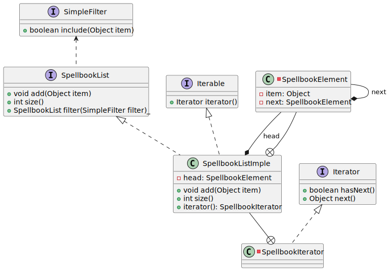

# Assignment: Creating a Magical Linked List - Preparing for Hogwarts

In this assignment, we'll delve into the magical world of Hogwarts by creating a system to prepare aspiring wizards and witches for their journey to the famed school of witchcraft and wizardry.

## Task 1: Creating the Hogwarts Preparatory List

### Storyline
Imagine yourself as a young wizard or witch, eagerly preparing to embark on a life-changing journey to Hogwarts School of Witchcraft and Wizardry. To ensure you're fully equipped for your magical education, you've been provided with a comprehensive list of essential items.

### Requirements

#### Create the UML Class Diagram
- Design a `HogwartsPreparation` class that encompasses the various elements required for a wizarding education.
- Utilize classes such as `Wand`, `Spellbook`, `Robes`, and `PotionIngredients`.
- Illustrate the relationships between these elements using UML diagrams.

#### Static Inner Classes for Magical Items
- Implement the `Wand`, `Spellbook`, `Robes`, and `PotionIngredients` as static inner classes within the `HogwartsPreparation` class.
- Consider the nature of these items and why making them static within the context of magical preparation might be beneficial.

### Linked List for Hogwarts' Wizardry Books

- We have a collection of beginner wizardry books intended for students at Hogwarts School of Witchcraft and Wizardry. These books are organized in a linked list structure, forming a sequential arrangement of wizardry books.

- The linked list comprises a controller, represented by the `SpellbookList` class, and individual elements, denoted by the `SpellbookElement` class, which encapsulates the actual content (payload) of each book.

- The `SpellbookList` class serves as the list controller, managing a reference to the initial book element (header). Each `SpellbookElement` holds a reference to the succeeding book element, forming the sequence. If an element is the last one in the list, it references a null value.

- Additionally, there exists a `SpellbookIterator` class that implements the `java.util.Iterator<T>` interface. This iterator enables traversal through the `SpellbookList`, facilitating iteration over the sequence of wizardry books.

- The class diagram illustrates these components: `SpellbookList` implementing `SimpleList` and `Iterable`, `SpellbookElement` representing the elements in the list, and `SpellbookIterator` implementing the `Iterator` interface for sequential traversal.

Overall, the diagram depicts a linked list structure tailored to manage a sequence of wizardry books, fulfilling the requirements outlined for Hogwarts' magical library.

#### Reflection
Think about the significance of having these elements encapsulated within a single class, resembling a wizard's starter kit.

## Task 2: Implementation
Here is the final class diagram of the exercise:

### Setup
1. Fork the magical repository provided.
2. Clone the forked repository to your local environment.
3. Import the project into your preferred IDE.

### Details
1. Implement `SpellbookElement` as a static inner class within the `SpellbookList` class.
	- Why is this class static and ideally `private`?
2. Implement the `SpellbookIterator` interface as a non-static inner class within the `SpellbookList` class.
   This class is crucial for traversing the linked list of spell books. 
   Ensure the iterator starts at the head of the list and progresses sequentially through the elements. 
   Making it non-static allows direct access to the outer class's (SpellbookList's) properties and methods, crucial for effective iteration.
	- Why is it helpful to make this class non-static?
3. Add the `Iterable` interface to your `SpellbookList`, and implement the required methods.
	- Why is implementing the `Iterable` interface essential for a (good) list implementation? (Hint: Check the test cases!)
	- Are there any language definition constraints to this? 
   #### Hints:
    - Implement the `add` method within the `SpellbookList` class to insert a given `Object` at the end of the linked list. 
      - Ensure the method handles both empty and non-empty lists appropriately. If the list is empty, set the new element as the head. 
      - For a non-empty list, traverse through the elements until reaching the end and add the new element there. Increment the size of the list after each addition.
      Consider implementing the `Iterable` interface to enable efficient iteration over the linked list of spell books. 
      A good list implementation should allow iteration through its elements seamlessly. The `Iterable` interface is essential for enabling enhanced list functionality, particularly when used in test cases. Ensure no language definition constraints hinder the implementation of this interface for the `SpellbookList` class.

### Anonymous (Inner) Classes and Lambda Expressions

1. Implement the `filter` method for your `SpellbookList` class to create a new filtered list that meets the criteria specified by the provided `SimpleFilter`. 
This method traverses through the existing list, identifying elements that match the filtering condition defined in the `SimpleFilter` interface's `include` method.
   - Create a new instance of `SimpleListImpl` to store filtered elements. 
   - Begin iteration from the list's head, examining each element's suitability against the condition stipulated in the `filter`. 
   - If an element meets the condition, add it to the new filtered list using the `add` method.
   
    Ensure the method appropriately handles cases where the provided filter includes or excludes elements according to the defined condition. Finally, return the resultant filtered list.
2. Refer to the given test suite for examples on:
	- How to use an anonymous class with an interface.
	- Replacing an anonymous class with a lambda expression.
3. Add test methods and implement additional filter logics (e.g., every third book, or specific words and lengths.).
4. Review anonymous classes and lambdas.
	- Lambda expressions look convenient; can you think of a scenario where they should not be used?
	- Consider how scoping works for anonymous (inner or local) classes; can you think of a scenario to avoid them?