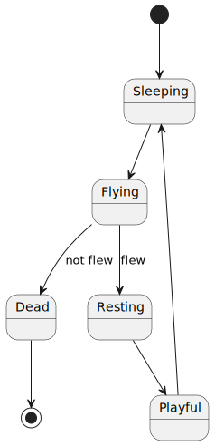
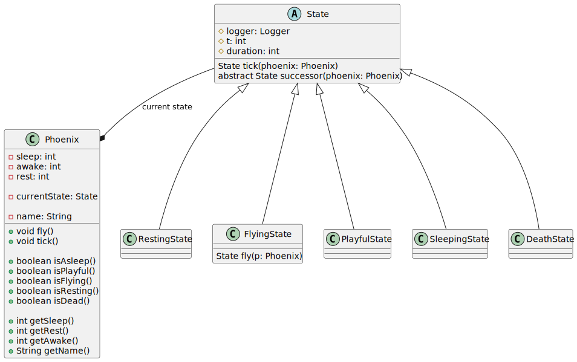

_This assignment is for students in the course Advanced Programming at the Wizarding University of Enchantment and Sorcery._

# Assignment 2: Inheritance revisited

In this assignment we'll be looking at

* a classical refactoring situation in the lifecycles of enchanted creatures: you have code that works, but with bad implementation
* `abstract` classes
* `final` classes
* when to use `abstract` base classes

## Task 1: On Paper!

### a)
Imagine a hierarchy of magical spells and wizards. Spells like Sectumsempra, Lumos, and Expelliarmus belong to either dark magic or good magic, while wizards such as Severus Snape, Sirius Black, and Harry Potter are associated with different magical spells.

Design a structure to represent this magical world using UML diagrams. Assign spells and wizards to their respective magical categories like dark or good magic.

Add a method `castSpell` to the base class, enabling spell casting in the subclasses. 
Implement `Spellcasting.castSpell(s)` as the method body, marking methods as `abstract`, `final` and `static` when appropriate for the enchanting world.

### b)

Given the following pseudo-code:

```java
interface DarkMagic {}

class GoodMagic implements DarkMagic {}

class DarkWizard extends GoodMagic {}

    GoodMagic good = new DarkWizard();
    DarkWizard wizard = new GoodMagic();
    DarkMagic dark = new DarkWizard();
    DarkMagic witch = new GoodMagic();
```

Identify the assignments that might lead to an error or if everything is correct in this magical code snippet.

## Task 2: Mystical Coding

Imagine navigating the lifecycle of Dumbledore's phoenix within a game. 
Given the Phoenix class modeling the phoenix lifecycle, simulate the progression of time as the game engine calls `.tick() for each phoenix.


In the following you can see the lifecycle of phoenixes modeled as [state machine](https://en.wikipedia.org/wiki/Finite-state_machine).

1. Begins in a dormant state.
2. Awakens and eagerly seeks to fly after a certain duration.
3. If unable to take flight within the specified time, it rapidly ages and then transitions into ashes, from which it is reborn
4. Concludes its flight and rest a set duration it enters a playful phase (now you could `collect()` rewards)
5. once again after a certain time it's getting tired and goes back to a dormant state.




### Your Assignment

Firstly, understand the given implementation of the `Phoenix.tick()` method, relying on a `switch-case`; refer to the `PhoenixTest` class for example state transitions.
Your task is to replace the existing `switch-case` by a clever polymorphism construct (which might be difficult to understand in contrast to the relatively simple state machine).
To gain insight into this possibility, consider the UML diagram below.
This diagram showcases an `abstract` base class `State` which implements (!) the `tick()` method and has an `abstract` method `successor()`; note that both methods use `Phoenix` reference as argument.
This method is needed to get the successor state if enough time passed (e.g. the phoenix has completed resting and is getting in playful mood).

The `State.tick()` method should be marked `final`; why is that?

_Hint: There's still one special case: when the phoenix cannot fly, it immediately transitions to the  **resting** state, regardless of its duration in the previous state._

The given test suite ensures that the behavior remains consistent. 
It's a classic refactoring scenario where you aim to substitute the existing implementation with a _better_ one without altering the behavior. 
This emphasizes the importance of test cases, not just for ensuring the implementation's correctness but also for improving it.

