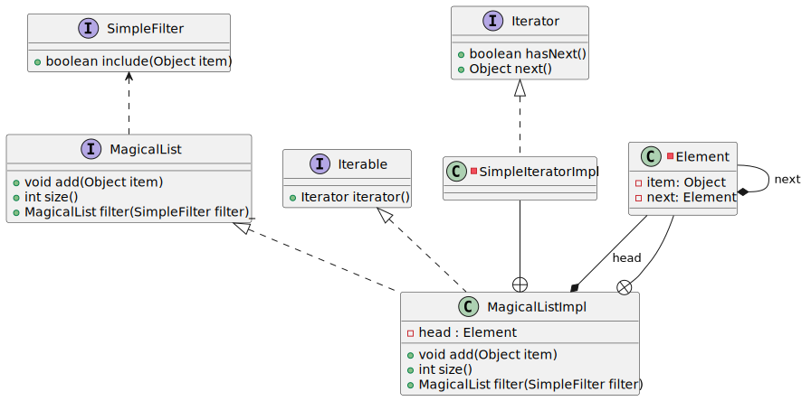
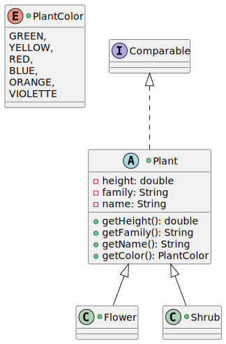
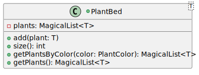
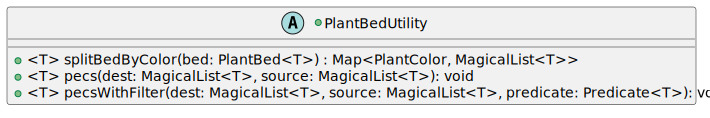

_For the Advanced Programming course at the Wizarding University of Enchantment and Sorcery._

# Assignment 3: Magical Generics

## Task 1: Magical Musical Harmony (on parchment!)

Given is the following code. It is not very clean. You could also say the 'code smells! 

Imagine that the switch statement would be more complex and even more complicated MIDI sequences would have to be programmed when playing the chords.


In a mystical realm where music and magic converge, troubleshoot a rather dissonant code involving the playing of chords. The code is not very clean. ('the code smells')

Imagine yourself at the enchanted halls of Hogwarts, where you're entrusted with a task to reform a jarring musical charm. The spell, currently entangled within a switch statement, could be more elegantly structured.

Transform this switch statement into an _enum_ class `Spell`. 
Ultimately, replacing the switch statement, your wizardry should conjure chords as easily as speaking an spell.


```java
public static void main(String[] args) {
   String spells = "Expelliarmus Lumos Accio Expelliarmus Patronus Expecto Patronum";
   for (String spell : spells.split(" ")) {
      switch (spell) {
         case "Expelliarmus":
            System.out.println("Disarming charm!"); break;
         case "Lumos":
            System.out.println("Illuminating spell!"); break;
         case "Accio":
            System.out.println("Summoning charm!"); break;
         case "Patronus":
            System.out.println("Patronus charm!"); break;
         case "Expecto":
            System.out.println("Expecto Patronum!"); break;
         default:
            System.out.println("Unknown spell!");
      }
   }
}
```

In the end, the switch statement should be replaceable by the following code:

```java
public static void main(String[] args) {
   List<Spell> spells = Arrays.asList(
           Spell.EXPELLIARMUS, Spell.LUMOS, Spell.ACCIO, Spell.EXPELLIARMUS, Spell.PATRONUS, Spell.EXPECTO_PATRONUM);
   for (Spell spell : spells) {
      spell.cast();
   }
}
```
How does the enum class `Spell` looks like?


## Task 2: Coding - Hogwarts Library
In this assignment, we embark on a magical journey to enhance the management of our beloved Hogwarts Library's catalog of enchanted books and artifacts.
We will use the knowledge which we gained in [Assignment 1](https://github.com/dustin2023/HarryPotter/tree/main/src/main/java/assignment/one_simple_list).
Previously, our library used a generic implementation, treating items as mere 'Objects,' requiring cumbersome type casting during retrieval:


```java
MagicalList magicalList = new MagicalListImpl();
magicalList.add(new SpellBook());
SpellBook k = (SpellBook) magicalList.get(0);
```

Within `MagicalListImpl`, crucial information about the actual class was lost. Moreover, the following code compiled but resulted in a runtime exception:


```java
MagicalList magicalList = new MagicalListImpl();
magicalList.add(new SpellBook());
magicalList.add(new Wand());
SpellBook book1 = (SpellBook) magicalList.get(0);  // All seems well
SpellBook book2 = (Wand) magicalList.get(1);  // ClassCastException!
```

Generics offer a solution by avoiding type casts and potential runtime exceptions, ensuring type safety at compile time

For this assignment, start with a similar solution of assignment 1 and the `abstract` model class `Plant`.


## Setup
Validate your environment by running the tests from your IntelliJ and by running `gradle test` on the command line.


## Generic Lists


### Mission Brief

To make a class generic, introduce a generic type (typically named `T`) in the class or interface signature, and replace all affected actual types with the generic type.

1. Make the following interfaces and classes generic
    * `MagicalList`
    * `MagicalListImpl`
    * `MagicalIterator`
    * `ListElement`
2. If necessary, adopt changes in the test class `MagicalListTests.java`
3. Remove now the unnecessary type casts
4. Add a method `get(...)` to the `MagicalList` interface, we will need to write the implementation in `MagicalListImpl`.
This method will return the element at the specified position in a list.
5. Add a new method `set(...)` to the `MagicalList` interface, we will need to write the implementation in `MagicalListImpl`.
This method it replaces the element at the specified position in a list with the specified element.


## Generic & Default Methods

In the second part we want to focus on generic and `default` methods.

1. Implement the `filter(...)` method as `default` method in the `MagicalList` interface. The method has an argument Predicate<T> this is a functional interface, which has 
a method `boolean test(T t)`. Usually, it used to apply in a filter for a collection of objects.

**Remember, an untested implementation is worthless! Write tests for the implemented method's .**


## Groundwork for Herbological Studies
In continuation of our magical journey, let us delve deeper into the realm of Herbology, enhancing the management of our enchanting catalog. 
As we expand our knowledge, we encounter various magical plants, each unique in its essence and mystical properties.

Begin by crafting the foundation for this assignment:



1. Create the `enum` _PlantColor_
2. Craft the `abstract` class _Plant_
3. Implement the child classes _Flower_ and _Shrub_<br>
   _Remarks:_ Shrubs are always green; while flowers span a spectrum of colors
   **excluding** green (handle a wrong value in the constructor - throw an
IllegalArgumentException).
4. Implement the `Comparable` accordingly to `Uml`, a plant is same if it has same height.
5. Employ rigorous testing to validate the integrity of your model classes (e.g., check the functionality of green flowers).


## Basic Bounds

Implement a `PlantBed` which manages a list of plants (use
`MagicalList<T>` which you can find in collections!).



A `PlantBed` encompasses any subclass of `MagicalPlant` but no other entities!
Use appropriate bounds when declaring the generic class.

_Insight:_ The method `getPlantsByColor` is very easy to implement, manifests through the`filter` method of the `MagicalList`! 
Be vigilant in creating test cases, ensuring comprehensive coverage for every line of code!


## Bounds on Wildcards

Last but not least let's unravel a distinctive challenge - the PECS (**P**roducer **E**xtends **C**onsumer **S**uper) principle.




1. Develop the utility method `splitBedByColor` in a utility class `PlantBedUtility`.
_Reflection:_ the above UML diagram for the utility method refrains from specifying any bounds. However, it's
**essential** to introduce some -- the compiler fails to capture the types if the method is strictly implemented as described in the UML!
2. We want to copy one `MagicalList<Flower>` into a `MagicalList<Plant>`, but this will not work because covariance is
not allowed with generics. The so-called wildcards provide a remedy.<br>
_Hint:_ <br>
`extends`(=Upper-bounded) to read<br>
`super`(=Lower-bounded-type) to write 
3. Engage in a similar exercise as above, this time employing the 'Predicate' to exclusively add yellow flowers into the destination list.

