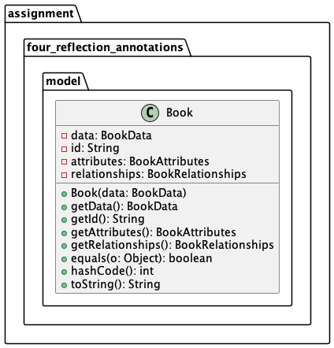

_For the Advanced Programming course at the Wizarding University of Enchantment and Sorcery._

# Assignment 4: Annotations and Reflection with the [Potter API](https://docs.potterdb.com/de)

In this assignment, let's delve into the magical realm of Java annotations, reflection, and integration with a remote RESTful API ([Representational State Transfer](https://en.wikipedia.org/wiki/Representational_state_transfer) API) 
based on the Potter DB, an enchanting repository of Harry Potter Universe data. This repository spans characters, movies, books, spells, and potions, making it an essential resource for all Potterheads and developers alike. ([Github](https://github.com/danielschuster-muc/potter-db#about-))

This assignment is split into two parts:
1. De-/Serializable with GSON
1. Remote REST calls with Retrofit.


## Gradle and Dependency Management

To complete this assignment you will need the following libraries:

* [Retrofit](http://square.github.io/retrofit/) by Square
* [Gson](https://github.com/google/gson) by Google

With Gradle, project dependencies (both at compile and runtime) are specified in the `build.gradle` file, in the `dependencies` section.
Open the existing [build.gradle](./build.gradle) file and inspect the `dependencies` object (Gradle uses [Groovy](http://groovy-lang.org/), a language similar to Java and Javascript).
Every dependency has a scope where it will be available.
To use a library across the whole project, declare it with the scope `implementation`.

As an example of dependencies:

```
dependencies {
    implementation("org.apache.commons:commons-lang3:$commons_lang3_version")
    implementation("org.apache.logging.log4j:log4j-api:${log4j2Version}")
    implementation("org.apache.logging.log4j:log4j-core:${log4j2Version}")

    // --> NEW DEPENDENCIES SHOULD GO HERE! FIND OUT WHICH!

    testImplementation("org.junit.jupiter:junit-jupiter-api:${junitVersion}")
    testImplementation("org.junit.jupiter:junit-jupiter-engine:${junitVersion}")
    testImplementation("org.junit.jupiter:junit-jupiter-params:${junitVersion}")
}
```

The dependencies for Retrofit and Gson you might find on the web sites! Please validate that these are the correct dependencies you need:

```
    implementation("com.squareup.retrofit2:retrofit:${retrofit_version}")
    implementation("com.squareup.retrofit2:converter-gson:${retrofit_version}")
```

Gradle is designed to help you in all development phases and is extensible by plugins.
In the given `build.gradle` are three plugins already applied:

* `java`: brings Java support to Gradle e.g. compilation)
* `application`: enable you to run and package the application you will develop in this assignment
* `idea`: helps with IntelliJ import

To run the `main` method in the `App` class without IntelliJ you can now use the following Gradle command on the command line:

```bash
gradle run
```


## Overview

The hard part of this assignment is you need to combine two parts to form the whole program:

- Gson for serialization (to/from [JSON](http://json.org))
- Retrofit for HTTP requests

It is strongly advised to read through the whole assignment and related documentations first; having the complete picture before starting with the parts helps a lot!


## Part I: Gson

In this part, we'll work on serializing and deserializing book information retrieved from the Potter API using Gson.
Google Gson is a library to serialize and deserialize [JSON](https://en.wikipedia.org/wiki/JSON) to or from Java objects.

### a)
Your task involves working with a class called `Book` (differing from the JSON format provided below) and performing serialization and deserialization. Employ Gson's annotations, particularly `@SerializedName`, to map between fields and keys in JSON.

Undertake serialization and deserialization with the `Book` class, ensuring robustness and correctness.
Craft a set of tests to validate the accuracy and integrity of serialization and deserialization, paying attention to various scenarios.
Experiment with creating your custom `toJson` and `fromJson`methods using reflection and annotations.


### Model

The Potter API provides book information in the following structure:
```json
{
  "data": {
    "id": "c8bde67b-7c62-48d4-9c7f-4987c41df86f",
    "type": "book",
    "attributes": {
      "slug": "harry-potter-and-the-goblet-of-fire",
      "author": "J. K. Rowling",
      "cover": "https://www.wizardingworld.com/images/products/books/UK/rectangle-4.jpg",
      "dedication": "To Peter Rowling, in memory of Mr Ridley and to Susan Sladden, who helped Harry out of his cupboard",
      "pages": 636,
      "release_date": "2000-07-08",
      "summary": "The Triwizard Tournament is to be held at Hogwarts. Only wizards who are over seventeen are allowed to enter – but that doesn't stop Harry dreaming that he will win the competition. Then at Hallowe'en, when the Goblet of Fire makes its selection, Harry is amazed to find his name is one of those that the magical cup picks out. He will face death-defying tasks, dragons and Dark wizards, but with the help of his best friends, Ron and Hermione, he might just make it through – alive!",
      "title": "Harry Potter and the Goblet of Fire",
      "wiki": "https://harrypotter.fandom.com/wiki/Harry_Potter_and_the_Goblet_of_Fire"
    },
    "relationships": {
      "chapters": {
        "data": [
          {
            "id": "cb21d978-f389-4f32-aec9-98f19f734e6a",
            "type": "chapter"
          }
        ]
      }
    },
    "links": {
      "self": "/v1/books/c8bde67b-7c62-48d4-9c7f-4987c41df86f"
    }
  },
  "meta": {
    "copyright": "Copyright © Potter DB 2024",
    "generated_at": "2024-01-10T11:01:17.199+00:00"
  },
  "links": {
    "self": "https://api.potterdb.com/v1/books/random"
  }
}
```
The usage of annotations within your Java classes will facilitate the mapping process. Reflect upon the provided JSON structure and use annotations to align Java fields with their JSON counterparts. Focus on creating a robust model adhering to the JSON's schema, leveraging the power of Gson's annotations.
The most basic use case is to de/serialize objects; by default, GSON uses reflection to determine the properties.
We'll create a corresponding Book class:
```java
class Book {
    private BookData data;
    private final String id;
    private final BookAttributes attributes;
    private final BookRelationships relationships;
}
```
We'll use Gson annotations (@SerializedName) to map JSON keys to the fields of our Book class.

Gson makes use of annotations to map JSON keys to fields of your class.
Have a look at the [docs](https://github.com/google/gson/blob/master/UserGuide.md) and complete the model described in the following UML:



> Hint: the given JSON object describes the exact structure of the JSON objects we want to deserialize.
> Use anntations to help gson map JSON fields to differently named Java field names.

**Here is what to do:**
- Import Gson to your project (dependencies in your build.gradle)
- Familiarize yourself with Gson by trying a few examples
- Get familiar with the `@SerializedName` annotation
- Get the code snippet in `App.main` running and try a fe serialization and deserelization things
- Write a couple of tests to your mapping correct

What is your Json would look like this?

```json
{
  "data": [
    {
      "id": "99015cdb-bf16-4042-863a-b25b41b004f2",
      "type": "book",
      "attributes": {
        "slug": "harry-potter-and-the-philosopher-s-stone",
        "author": "J. K. Rowling",
        "cover": "https://www.wizardingworld.com/images/products/books/UK/rectangle-1.jpg",
        "dedication": "For Jessica, who loves stories, for Anne, who loved them too, and for Di, who heard this one first",
        "pages": 223,
        "release_date": "1997-06-26",
        "summary": "Harry Potter has never even heard of Hogwarts when the letters start dropping on the doormat at number four, Privet Drive. Addressed in green ink on yellowish parchment with a purple seal, they are swiftly confiscated by his grisly aunt and uncle. Then, on Harry's eleventh birthday, a great beetle-eyed giant of a man called Rubeus Hagrid bursts in with some astonishing news: Harry Potter is a wizard, and he has a place at Hogwarts School of Witchcraft and Wizardry. An incredible adventure is about to begin!",
        "title": "Harry Potter and the Philosopher's Stone",
        "wiki": "https://harrypotter.fandom.com/wiki/Harry_Potter_and_the_Philosopher's_Stone"
      },
      "relationships": {
        "chapters": {
          "data": [
            {
              "id": "a5b54618-9282-4cc0-a881-c71a3f70aae6",
              "type": "chapter"
            },
            {
              // ...
            }
          ]
        }
      },
      "links": {
        "self": "/v1/books/99015cdb-bf16-4042-863a-b25b41b004f2"
      }
    },
    {
      "id": "35bc68ec-1ea1-40a9-a511-2d80f5dc7c71",
      "type": "book",
      "attributes": {
        "slug": "harry-potter-and-the-chamber-of-secrets",
        "author": "J. K. Rowling",
        "cover": "https://www.wizardingworld.com/images/products/books/UK/rectangle-2.jpg",
        "dedication": "For Séan P. F. Harris, getaway driver and foul-weather friend",
        "pages": 251,
        "release_date": "1998-07-02",
        "summary": "Harry Potter's summer has included the worst birthday ever, doomy warnings from a house-elf called Dobby, and rescue from the Dursleys by his friend Ron Weasley in a magical flying car! Back at Hogwarts School of Witchcraft And Wizardry for his second year, Harry hears strange whispers echo through empty corridors – and then the attacks start. Students are found as though turned to stone... Dobby's sinister predictions seem to be coming true.",
        "title": "Harry Potter and the Chamber of Secrets",
        "wiki": "https://harrypotter.fandom.com/wiki/Harry_Potter_and_the_Chamber_of_Secrets"
      },
      "relationships": {
        "chapters": {
          "data": [
            {
              "id": "ff3d528b-7271-4924-813b-d22cf6b0b161",
              "type": "chapter"
            },
            {
              // ...
            }
          ]
        }
      },
      "links": {
        "self": "/v1/books/35bc68ec-1ea1-40a9-a511-2d80f5dc7c71"
      }
    },
    {
      // ...
    }
}
```

* Can you write a Java class to which GSON could serialize this?
* Make reuse of your `Joke` class

> Hint: create a new class `Books` and use a List of `Book` objects as a field.


## Part II: Engaging with Retrofit and Gson Interplay with the Potter API

Dive deeper into Retrofit, a library aiding HTTP client implementation, and the seamless integration with Gson.
Embark on an adventure to connect with the Potter DB via Retrofit.
Open your browser and try the following URL:

[https://api.chucknorris.io/jokes/random](https://api.potterdb.com/v1/books/random)

As you could see, the actual response body of the Harry Potter API looks like the following (your might be different content-wise since it is random!):

```json
{
  "data": {
    "id": "c8bde67b-7c62-48d4-9c7f-4987c41df86f",
    "type": "book",
    "attributes": {
      "slug": "harry-potter-and-the-goblet-of-fire",
      "author": "J. K. Rowling",
      "cover": "https://www.wizardingworld.com/images/products/books/UK/rectangle-4.jpg",
      "dedication": "To Peter Rowling, in memory of Mr Ridley and to Susan Sladden, who helped Harry out of his cupboard",
      "pages": 636,
      "release_date": "2000-07-08",
      "summary": "The Triwizard Tournament is to be held at Hogwarts. Only wizards who are over seventeen are allowed to enter – but that doesn't stop Harry dreaming that he will win the competition. Then at Hallowe'en, when the Goblet of Fire makes its selection, Harry is amazed to find his name is one of those that the magical cup picks out. He will face death-defying tasks, dragons and Dark wizards, but with the help of his best friends, Ron and Hermione, he might just make it through – alive!",
      "title": "Harry Potter and the Goblet of Fire",
      "wiki": "https://harrypotter.fandom.com/wiki/Harry_Potter_and_the_Goblet_of_Fire"
    },
    "relationships": {
      "chapters": {
        "data": [
          {
            "id": "cb21d978-f389-4f32-aec9-98f19f734e6a",
            "type": "chapter"
          }, 
          {
            // ...
          }
        ]
      }
    },
    "links": {
      "self": "/v1/books/c8bde67b-7c62-48d4-9c7f-4987c41df86f"
    }
  },
  "meta": {
    "copyright": "Copyright © Potter DB 2024",
    "generated_at": "2024-01-10T13:21:53.563+00:00"
  },
  "links": {
    "self": "https://api.potterdb.com/v1/books/random"
  }
}
```

The actual book (`Book`) needs to be an extended version so that it matches the returned json!

* Test if deserialization would work.

## Retrofit

Construct an interface named `PotterApiService` to encapsulate various API methods.
- Get the correct dependencies in your `build.gradle`
- Begin by implementing the `getRandomBook()` method within the interface, adorned with Retrofit annotations to decode the interface method.
- Modify the `App` class's `main` method to initialize the `PotterApiService` using Retrofit.Builder.

Read through the [Retrofit documentation](http://square.github.io/retrofit/) and implement the `PotterApiService` so that you can provide a query string and return a list of jokes.

```java
		Retrofit retrofit = new Retrofit.Builder()
			.baseUrl("https://api.potterdb.com")
			.addConverterFactory(GsonConverterFactory.create())
			.build();
```

- As you can see in the interface definition of ICNDBApi we are using either the `Book` or the `Books` class directly.
- To do so, we have to use the `GsonConverterFactroy` (as you can see in the code above!)
- Print a random book to `System.out`, and complete the test methods `testGetRandomBook` and `testGetBookByQuery`. Recall that you work with `Call` objects that need to be executed before you can retrieve the response body.
- After completing the `getRandomBook()` method try to add the other methods.
- If you are not sure if your query strings are correct you can test them within the command line using `curl` or in a browser extension such as [Postman](https://www.getpostman.com/).

Most unix systems will provide the cURL program:

```bash
curl -X GET "https://api.potterdb.com/v1/books/random" -H "accept: application/json"
```

On Windows, you can use the PowerShell to accomplish the same like so:

```ps
(Invoke-WebRequest
    -Uri https://api.potterdb.com/v1/books/random
    -Headers @{"accept"="application/json"}
    ).Content | ConvertFrom-Json | ConvertTo-Json
```

(The part `| ConvertFrom-Json | ConvertTo-Json` is only necessary for formatting.)

_Remark: to execute this command you have to remove the newlines!_


Let the combined magic of Retrofit and Gson bring forth the enchanting world of the Potter DB to your fingertips. Test, explore, and ensure a seamless flow between the remote API and your Java code.

## Additional Instructions:

At the end of the assignment, encourage students to engage further with the Potter API by playing around with retrieving data related to **movies**, **characters**, **spells**, or **potions**. 
They should experiment with deserializing and serializing different endpoints of the Potter API, besides books.

- Emphasize the importance of writing **clean code**, especially optimizing the `App` class. Advise them to implement **logging** using a logging framework like **Log4j** instead of using `System.out.println`. 
- Encourage the utilization of appropriate design patterns and principles to enhance the code's readability, maintainability, and extensibility. 
- Remind them to test the accuracy of serialization and deserialization by crafting comprehensive test cases. 

- Additionally, instruct them to validate the correctness of the Retrofit implementation by writing tests for different API endpoints. 
- Provide guidance on exploring **Retrofit** and **Gson** **documentation** for a more in-depth understanding and seamless integration with the Potter API.

This holistic approach will not only deepen their understanding of annotations, reflection, Retrofit, and Gson but also strengthen their practical skills in developing robust Java applications **interacting with remote APIs**.

_Good luck, and may your code be as enchanting as the Wizarding World itself!_